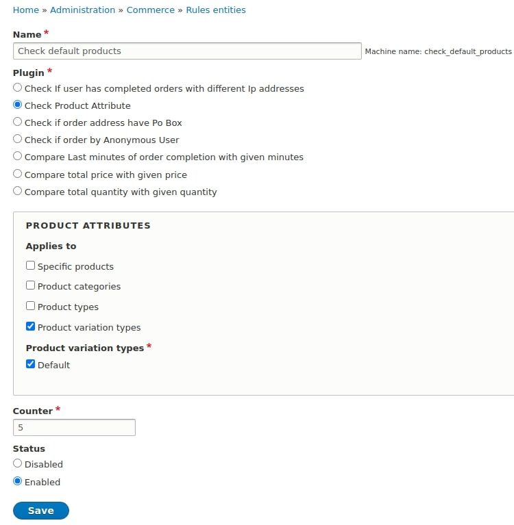
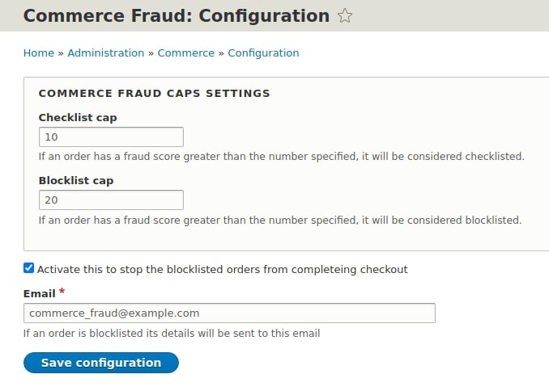

Commerce Fraud
==============

This module provides framework to detect potentially fraudulent
orders and steps to be taken to stop fraudulent orders.

FEATURES
--------

- Rules Config entity with seven default rules to keep check on orders
- Classifying orders on the basis of fraud score calculated from rules
- Suspected Order Content entity displays details about order that have applied fraudulent rules
- Create an suspected order entity for orders and set their fraud score with custom available rules
- Stopping fraudulent orders from completing checkout
- Emails sent to administrators about the fraudulent orders

This module provides:

- Rules config entity for creating rules with given conditions
- 7 Rules conditions:
    - Checks if Order by Anonymous User
    - Checks Order User IP address
    - Checks Order Last Minute
    - Checks Order Address for Po Box
    - Checks Product Attribute
    - Checks Order Total Price
    - Checks Order Total Quantity
- Suspected Order entity for details of order that were applicable to rules
- 1 Fraud event:
    - Increase the fraud score
    - Decrease the fraud score
    - Update the fraud score
- Fraud rule logging category

The Rules action will increase the fraud score any orders made. This fraud score represents the likelihood of an order being fraudulent.
With this suspected order entity is created to store the information about the order.
The "Increase the fraud score" and "Decrease the fraud score" actions will increase or decrease this fraud score, by the default 5 (But this is customizable).

The "Fraud score changed" event is fired every time one of the actions
is called.

The limits used by the 3 conditions are configurable in `/admin/commerce/config/commerce_fraud`. By default, they are:

- An order is whitelisted if the fraud score is < 10
- An order is greylisted if it's between 10 and 20
- An order is blacklisted if the fraud score is >= 20

INSTALLATION
------------

Install as you would normally install a contributed Drupal module. Visit https://www.drupal.org/node/1897420 for further information.

REQUIREMENTS
------------

These modules are required for Commerce Fraud:

 - action
 - entity
 - views
 - options
 - commerce
 - commerce:commerce_order

CONFIGURATION
-------------

Once you've installed the module, navigate to `/admin/commerce/rules`.
This is where you can add new rules and modify existing ones.
Rules are what orders will be checked against for fraudulent activity.
You need to add at least one rule to utilize this module properly.

The module has some settings under the Commerce configuration (`/admin/commerce/config/commerce_fraud`).

- Checklist and Blocklist
    - These value caps are used to classify orders as genuine or fraudulent

- Stop order check box
    - This checks whether a fraudulent order should be stopped from completing checkout

- Send email
    - This is the email used to send details about fraudulent orders

TROUBLESHOOTING
---------------

If a rule does not work properly, clear the sites caches and check the following:

- Is the rule enabled?

- Is there activity showing in the site logs?

- More details about the order can be found in the site suspected order list menu (/admin/commerce/config/suspected_order)

- Finally, if the problem persists create an issue with relevant details in the [issue queue](https://www.drupal.org/project/issues/commerce_fraud)

Maintainers
-----------

Current maintainers:

- Shawn McCabe - [smccabe](https://www.drupal.org/u/smccabe)
- Josh Miller - [joshmiller](https://www.drupal.org/u/joshmiller)
- Derek Cresswell - [derekcresswell](https://www.drupal.org/u/derekcresswell)

Developed by [Acro Media Inc][0], sponsored by [Skilld.fr][1] and also developed by [Commerce Guys][2].

[0]: http://www.acromediainc.com
[1]: http://www.skilld.fr
[2]: https://commerceguys.com
